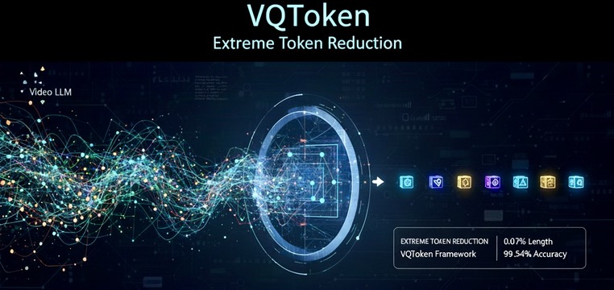

# VQToken: Neural Discrete Token Representation Learning for Extreme Token Reduction in Video LLMs

<p align="center"><b>Accepted by NeurIPS 2025</b></p>


<p align="center">
  <a href="https://arxiv.org/pdf/2503.16980">
    
  </a>
  <a href="https://www.zhanghaichao.xyz/VQToken/">
    
  </a>
  <a href="https://huggingface.co/haichaozhang/VQ-Token-llava-ov-0.5b">
    
  </a>
  <a href="https://github.com/Hai-chao-Zhang/VQToken">
    
  </a>
</p>

<p align="center">
  
</p>

---

## 🔎 What is VQToken?

**VQToken** learns **discrete neural tokens** for video that enable Video-LLMs to run with **as little as 0.07%** of the original tokens while retaining strong performance. It supports **fixed-length** and **adaptive-length** token budgets and plugs directly into **LLaVA-OneVision** via **lmms-eval**.

- **Extreme Token Reduction**: ~**0.07%** of discrete tokens  
- **VQ-style discrete tokens** with motion/dynamics awareness  
- **Fixed / Adaptive** token-length regimes  
- **Plug-and-play** with **LLaVA-OneVision (0.5B)** through **lmms-eval**

**arXiv:** https://arxiv.org/pdf/2503.16980  
**GitHub repo:** https://github.com/Hai-chao-Zhang/VQToken  
**Hugging Face model:** https://huggingface.co/haichaozhang/VQ-Token-llava-ov-0.5b  
**Webpage:** https://www.zhanghaichao.xyz/VQToken/

---

## 👥 Authors
<p align="center">
  <a href="https://zhanghaichao.xyz"><b>Haichao Zhang</b></a> ·
  <a href="https://www1.ece.neu.edu/~yunfu/"><b>Yun Fu</b></a>
</p>
<p align="center">
  <sub> SMILE Lab, Northeastern University</sub>
</p>
<p align="center">
  
  &nbsp;&nbsp;&nbsp;
  
  &nbsp;&nbsp;&nbsp;
</p>


---

## 📅 **Timeline**

| Date | Status | Description |
|------|--------|-------------|
| **2025/09/20** | ✅ | Release **VQ-Token 0.5B** pretrained model on Hugging Face |
| **2025/09/22** | ✅ | Release **testing & training code** (this repo) |
| *TBD* | ⭕ | Project **website** enhancements go online |
| *TBD* | ⭕ | Update **Hugging Face model card README** |
| *Future Ideas* | 💡 | Suggestions/collab: `zhang dot haich at northeastern dot edu` |

---

## 🗂️ File Tree

```
VQToken
├─ VLMEvalKit/              # VLMEvalKit evaluation
├─ VQToken/                 # VQToken core code
├─ llava/                   # modified from LLaVA-OneVision
├─ lmms_eval/               # lmms-eval Evaluation (preferred)
├─ finetune_ov_all.sh      # train bash
└─ test_vqtoken_0.5b.sh    # test bash
```

---

## 🛠️ Installation

```bash
# clone your repo
git clone https://github.com/Hai-chao-Zhang/VQToken.git
cd VQToken

# conda env
conda create -n vqtoken python=3.10 -y
conda activate vqtoken

# install lmms-eval (dev mode)
git clone https://github.com/EvolvingLMMs-Lab/lmms-eval
cd lmms-eval
pip install -e .
cd ..

# install VQToken (train extras)
pip install -e ".[train]"
```

---

## 🚀 Quickstart: Evaluation

Environment variables (adjust as needed):
```bash
export HF_HOME="/path/to/your/hf/cache"
export HF_TOKEN="your_hf_token_here"
export HF_HUB_ENABLE_HF_TRANSFER=1

# Optional (only if any eval calls OpenAI endpoints)
export OPENAI_API_KEY="your_openai_key_here"

# Helpful on some single-GPU setups
export NCCL_P2P_DISABLE="1"
export NCCL_IB_DISABLE="1"
```

Run ActivityNet-QA with the 0.5B OneVision checkpoint:
```bash
PRETRAIN=haichaozhang/VQ-Token-llava-ov-0.5b

CUDA_VISIBLE_DEVICES=2 accelerate launch --num_processes=1 --main_process_port 29509   -m lmms_eval   --model llava_onevision_vqtoken   --model_args pretrained=$PRETRAIN,conv_template=qwen_1_5,model_name=llava_qwen   --tasks activitynetqa --batch_size 1   --log_samples   --log_samples_suffix llava_onevision   --output_path ./logs_new/
```

Or simply:
```bash
bash https://raw.githubusercontent.com/Hai-chao-Zhang/VQToken/main/test_vqtoken_0.5b.sh
```

> You can change `--tasks` to other video QA benchmarks available in **lmms-eval**.

---

## 🧪 Minimal Prediction Snippet

```python
import os, copy, time, torch, numpy as np
from decord import VideoReader, cpu
from llava.model.builder import load_pretrained_model
from llava.mm_utils import tokenizer_image_token
from llava.constants import IMAGE_TOKEN_INDEX, DEFAULT_IMAGE_TOKEN
from llava.conversation import conv_templates

device = "cuda:0" if torch.cuda.is_available() else "cpu"
pretrained = "haichaozhang/VQ-Token-llava-ov-0.5b"
tokenizer, model, image_processor, _ = load_pretrained_model(
    pretrained, None, "llava_qwen", device_map="auto",
    attn_implementation="sdpa", multimodal=True
)
model.eval()

def load_video_frames(path, n=16):
    vr = VideoReader(path, ctx=cpu(0))
    idx = np.linspace(0, len(vr)-1, n, dtype=int).tolist()
    return vr.get_batch(idx).asnumpy()  # (T,H,W,C)

video = "sample/demo.mp4"
frames_np = load_video_frames(video, 16)
frames = image_processor.preprocess(frames_np, return_tensors="pt")["pixel_values"].half().to(device)
image_tensors = [frames]

conv = copy.deepcopy(conv_templates["qwen_1_5"])
question = f"{DEFAULT_IMAGE_TOKEN}\nDescribe what's happening in this video."
conv.append_message(conv.roles[0], question)
conv.append_message(conv.roles[1], None)
prompt = conv.get_prompt()

input_ids = tokenizer_image_token(prompt, tokenizer, IMAGE_TOKEN_INDEX, return_tensors="pt").unsqueeze(0).to(device)
image_sizes = [f.shape[:2] for f in frames_np]

with torch.no_grad():
    out = model.generate(
        input_ids, images=image_tensors, image_sizes=image_sizes,
        do_sample=False, temperature=0, max_new_tokens=512,
        modalities=["video"], vis=True
    )

print(tokenizer.batch_decode(out, skip_special_tokens=True)[0])
```

---

## 🏋️ Training

- OneVision 0.5B finetuning example:  
  `bash finetune_ov_all.sh`

---

## 📚 Citation
```bibtex
@inproceedings{zhang2025vqtoken,
  title     = {VQToken: Neural Discrete Token Representation Learning for Extreme Token Reduction in Video Large Language Models},
  author    = {Haichao Zhang and Yun Fu},
  booktitle = {NeurIPS},
  year      = {2025}
}
```

---

## 🙏 Acknowledgements
Thanks to the **LLaVA-OneVision / LLaVA-NeXT** and **lmms-eval** communities for the open tooling and baselines.
