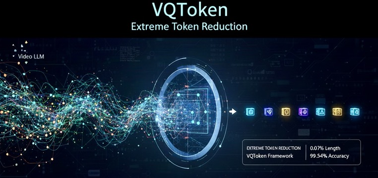

# VQToken: Neural Discrete Token Representation Learning for Extreme Token Reduction in Video LLMs

<p align="center"><b>Accepted by NeurIPS 2025</b></p>

<p align="center">
  <span style="display:inline-block;background:#ffffff;padding:6px 10px;border-radius:8px;border:1px solid #e5e7eb;">
    
  </span>
</p>


<p align="center">
  <a href="https://arxiv.org/pdf/2503.16980">
    
  </a>
  <a href="https://www.zhanghaichao.xyz/VQToken/">
    
  </a>
  <a href="https://huggingface.co/haichaozhang/VQ-Token-llava-ov-0.5b">
    
  </a>
  <a href="https://github.com/Hai-chao-Zhang/VQToken">
    
  </a>
</p>

<p align="center">
  
</p>

---

## 🔎 What is VQToken?

**VQToken** learns **discrete neural tokens** for video that enable Video-LLMs to run with **as little as 0.07%** of the original tokens while retaining strong performance. It supports **fixed-length** and **adaptive-length** token budgets and plugs directly into **LLaVA-OneVision** via **lmms-eval**.

- **Extreme Token Reduction**: ~**0.07%** of discrete tokens  
- **VQ-style discrete tokens** with motion/dynamics awareness  
- **Fixed / Adaptive** token-length regimes  
- **Plug-and-play** with **LLaVA-OneVision (0.5B)** through **lmms-eval**

**arXiv:** https://arxiv.org/pdf/2503.16980  
**GitHub repo:** https://github.com/Hai-chao-Zhang/VQToken  
**Hugging Face model:** https://huggingface.co/haichaozhang/VQ-Token-llava-ov-0.5b  
**Webpage:** https://www.zhanghaichao.xyz/VQToken/

---

## 👥 Authors
<p align="center">
  <a href="https://zhanghaichao.xyz"><b>Haichao Zhang</b></a> ·
  <a href="https://www1.ece.neu.edu/~yunfu/"><b>Yun Fu</b></a>
</p>
<p align="center">
  <sub> SMILE Lab, Northeastern University</sub>
</p>
<p align="center">
  
  &nbsp;&nbsp;&nbsp;
  
  &nbsp;&nbsp;&nbsp;
</p>


---

## 📅 **Timeline**

| Date | Status | Description |
|------|--------|-------------|
| **2025/09/20** | ✅ | Release **VQ-Token 0.5B** pretrained model on Hugging Face |
| **2025/09/21** | ✅ | Release **testing & training code** (this repo) |
| **2026/08/10**  | ✅ | Project **website** enhancements go online |
| ***2026/08/10** | ✅ | Update **Hugging Face model card README** |
| *TBD* | ⭕ | Pull Request our method in lmms-eval and VLMevalkit for easy evaluation  |
| *Future Ideas* | 💡 | Suggestions/collab: `zhang dot haich at northeastern dot edu` |

---

## 🗂️ File Tree

```
VQToken
├─ VLMEvalKit/              # VLMEvalKit evaluation
├─ VQToken/                 # VQToken core code
├─ llava/                   # modified from LLaVA-OneVision
├─ lmms_eval/               # lmms-eval Evaluation (preferred)
├─ finetune_ov_all.sh      # train bash
└─ test_vqtoken_0.5b.sh    # test bash
```

---

## 🛠️ Installation

The supported environment is Linux with Python 3.10 and a CUDA-capable GPU. The
repository vendors its VQToken-aware `lmms_eval`; do not clone a second copy of
`lmms-eval` into this checkout.

```bash
git clone https://github.com/Hai-chao-Zhang/VQToken.git
cd VQToken

conda create -n vqtoken python=3.10 -y
conda activate vqtoken

# Inference/evaluation plus unit tests
python -m pip install --upgrade pip
python -m pip install -e ".[eval,test]"
python -m pip check
pytest -q tests

# Add training dependencies only when needed
python -m pip install -e ".[train]"
```

---

## 🚀 Quickstart

### 1. Core tests (no model download)

```bash
pytest -q tests/test_vqtoken_core.py
```

### 2. One-video GPU smoke test

The bounded smoke test uses the bundled MP4 and, by default, the ungated public
LLaVA-OneVision 0.5B base checkpoint. VQToken compression is explicitly enabled,
so this validates the code path without benchmark data or paid evaluator APIs.
The `llava_onevision_vqtoken` evaluator uses the same public checkpoint as its
anonymous-access default; select the released checkpoint explicitly for paper
checkpoint results.

```bash
CUDA_VISIBLE_DEVICES=0 bash test_vqtoken_0.5b.sh
```

The released VQToken checkpoint is currently a gated Hugging Face repository
(`private=false`, `gated=auto`). After accepting its access terms, authenticate
with your own token and select it explicitly:

```bash
export HF_TOKEN="<token for an account with approved access>"
PRETRAIN=haichaozhang/VQ-Token-llava-ov-0.5b \
CUDA_VISIBLE_DEVICES=0 \
bash test_vqtoken_0.5b.sh
```

The script pins known model revisions, downloads only inference artifacts (not
optimizer states), and reuses the SigLIP weights embedded in compatible
OneVision checkpoints instead of fetching a second 3.5 GB vision checkpoint.

### 3. Full `lmms-eval` benchmark (optional)

ActivityNetQA is **not** a smoke test: its video archives exceed 120 GiB and its
configured metric calls an OpenAI judge for every sample. Run it only after
preparing sufficient storage and intentionally configuring that paid API.

```bash
export HF_HOME="/path/with/at-least-250-GiB-free"
export OPENAI_API_KEY="<key you intend to use for benchmark judging>"
# Optional: export OPENAI_MODEL="<judge model available to your account>"
PRETRAIN=haichaozhang/VQ-Token-llava-ov-0.5b

CUDA_VISIBLE_DEVICES=0 accelerate launch --num_processes=1 --main_process_port 29509 \
  -m lmms_eval \
  --model llava_onevision_vqtoken \
  --model_args pretrained=$PRETRAIN,conv_template=qwen_1_5,model_name=llava_qwen \
  --tasks activitynetqa \
  --batch_size 1 \
  --limit 1 \
  --log_samples \
  --output_path ./logs_new/
```

> You can change `--tasks` to other video QA benchmarks available in **lmms-eval**.

---

## 🧪 Minimal Prediction

```bash
python scripts/smoke_inference.py --help
python scripts/smoke_inference.py \
  --video playground/demo/xU25MMA2N4aVtYay.mp4 \
  --device cuda:0
```

---

## 🏋️ Training

Training data mixtures are large and must be prepared locally. The launcher no
longer contains fake API keys, private checkpoint paths, or hard-coded GPU IDs;
it validates inputs before starting.

```bash
export DATA_YAML=/absolute/path/to/prepared-datasets.yaml
export IMAGE_FOLDER=/absolute/path/to/images
export VIDEO_FOLDER=/absolute/path/to/videos
export CUDA_VISIBLE_DEVICES=0,1,2,3
export PRETRAINED_MODEL=lmms-lab/llava-onevision-qwen2-0.5b-ov

bash finetune_ov_all.sh
```

The default base checkpoint embeds its SigLIP weights. If you substitute a
checkpoint that does not, set `USE_EMBEDDED_VISION=false` so the configured
vision tower is loaded separately.

Set `REPORT_TO=wandb` only after configuring your own W&B credentials. The
public LLaVA-OneVision data collections are linked in
[`scripts/train/README.md`](scripts/train/README.md), but several legacy YAMLs
still contain original cluster paths and must be rewritten for your layout.

---

## 📚 Citation
```bibtex
@inproceedings{zhang2025vqtoken,
  title={VQToken: Neural Discrete Token Representation Learning for Extreme Token Reduction in Video Large Language Models},
  author={Zhang, Haichao and Fu, Yun},
  booktitle={The Thirty-ninth Annual Conference on Neural Information Processing Systems},
  year={2025}
}
```

---

## 🙏 Acknowledgements
Thanks to the **LLaVA-OneVision / LLaVA-NeXT** and **lmms-eval** communities for the open tooling and baselines.
